# 1701QCA Making Interaction - Assessment 2 workbook

## Project working title ##
Hunters

## Related projects ##
*Find about 6 related projects to the project you choose. 

### Related project 1 ###
Micro:bit Electro Football 

https://make.techwillsaveus.com/microbit/activities/microfootball

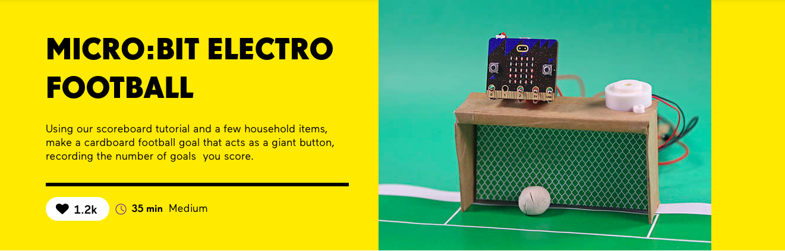

This project is related to my first design concept, because it allows the person to score a ball against a goalnet with the Micro:bit to keep track of the score. This project allowed me to visualise the utilisation of public space and how multiple sports can be played on one field. 

### Related project 2 ###
Don't touch the wire

https://bryanmmathers.com/dont-touch-wire/

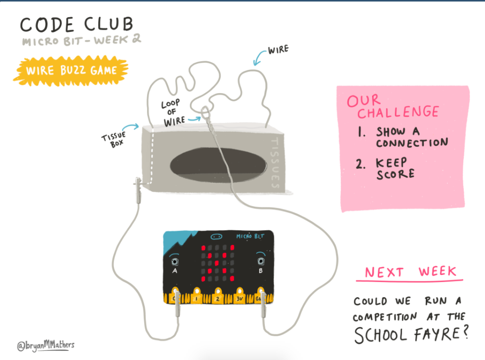

This project made me to realised that I can create different difficulty levels for a project, in which it aligns well with my second design concept.

### Related project 3 ###

## Other research ##
*Include here any other relevant research you have done. This might include identifying readings, tutorials, videos, technical documents, or other resources that have been helpful. For each particular source, add a comment or two about why it is relevant or what you have taken from it.*

### *Brief resource name/description* ###

*Provide a link, reference, or whatever is required for somebody else to find the resource. Then provide a few comments about what you have drawn from the resource.*

## Conceptual progress ##

### Design intent ###
Hunt the prize using hand-eye coordiation whilst avoiding the obstacle. 

### Design concept 1 ###
Originally I wanted to develop a sport field/facility that will allow different types of sports to be played within a confined space. The field can be made by a shoebox or an object with similar dimensions. 

The first idea was to have a sport field that can hold 2 sports: international football and basketball, but they can't be played concurrently - as only one net at one end to score. The second idea was to have the same 2 sports but with a divider net/wall in between, have multiple Micro:bit to keep score, and can play concurrently. 

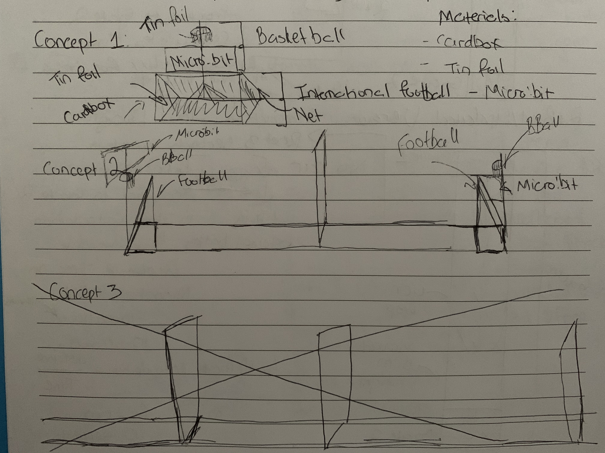

The third idea was to have more than 2 sports, but on a bigger scale, similar to the size of a coffee table or something to the extent. 

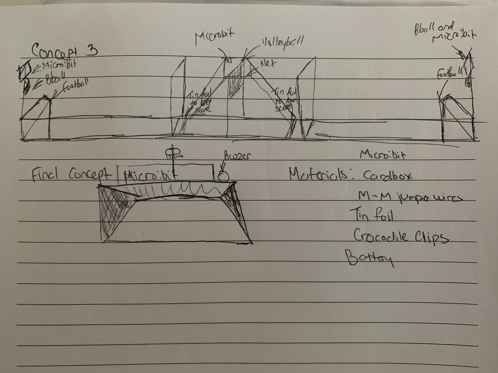

### Design concept 2 ###
I switched my original idea to contribute efforts in the current Covid-19 Pandemic, by potentially encouraging people to stay indoors. This will be done through increasing people's attention span and determination, as people will attempt to not touch aluminum coil whilst crossing it throughout different levels and challenges. The project will be call Don't Touch The Wire. 

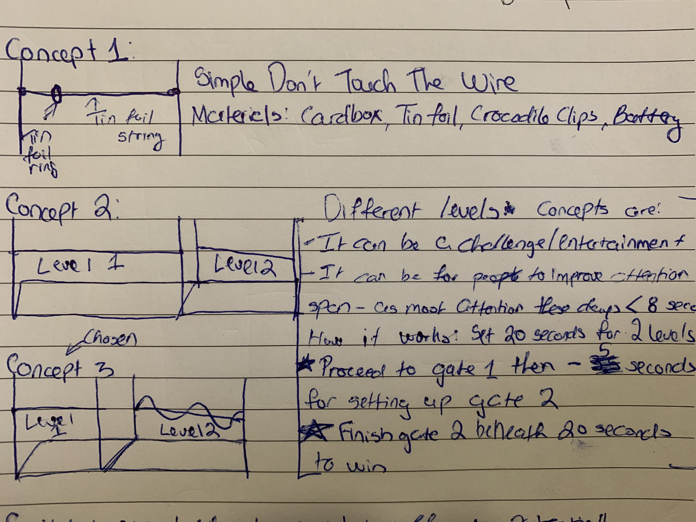

### Final design concept ###
The second design concept gave me the overall concept for my project: hand-eye coordination. Using the materials and concept from my second concept, I am able to create a family-friendly game where people will try to grab a prize without touching the surrounding to avoid loosing and triggering the alarm on.

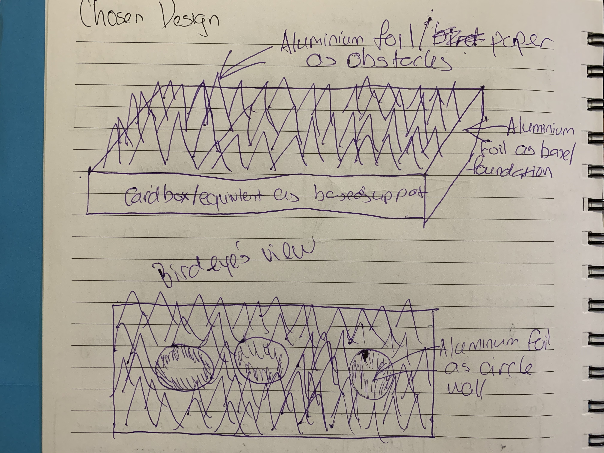

### Interaction flowchart ###
*Draw a draft flowchart of what you anticipate the interaction process in your project to be. Make sure you think about all the stages of interaction step-by-step. Also make sure that you consider actions a user might take that aren't what you intend in an ideal use case. Insert an image of it below. It might just be a photo of a hand-drawn sketch, not a carefully drawn digital diagram. It just needs to be legible.*

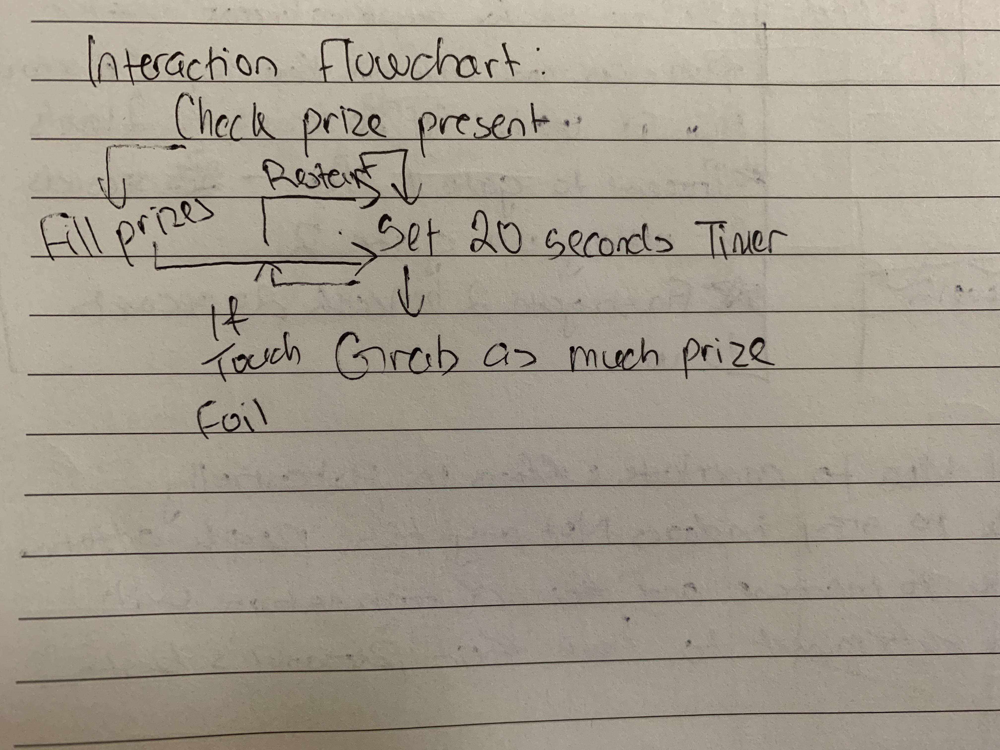

## Physical experimentation documentation ##

*In this section, show your progress including whichever of the following are appropriate for your project at this point.
a.	Technical development. Could be code screenshots, pictures of electronics and hardware testing, video of tests. 
b.	Fabrication. Physical models, rough prototypes, sketches, diagrams of form, material considerations, mood boards, etc.
Ensure you include comments about the choices you've made along the way.*

*You will probably have a range of images and screenshots. Any test videos should be uploaded to YouTube or other publicly accessible site and a link provided here.*

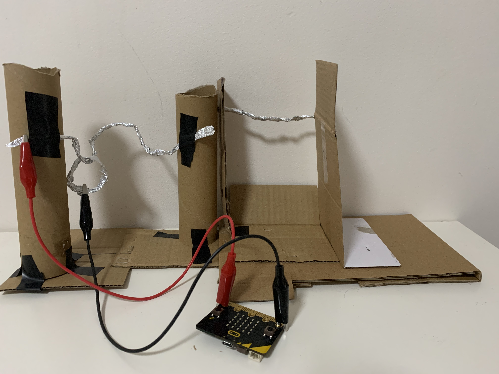

The image represents the earlier developments that I made in my second design concept, which ended up helping me to understand how certain materials interact with one another, and more importantly how I can utilise the materials to my advantage. For example, I can use the same aluminum material to design different challenges throughout the game. 

The following image relates to how the second design concept systematically run via coding.

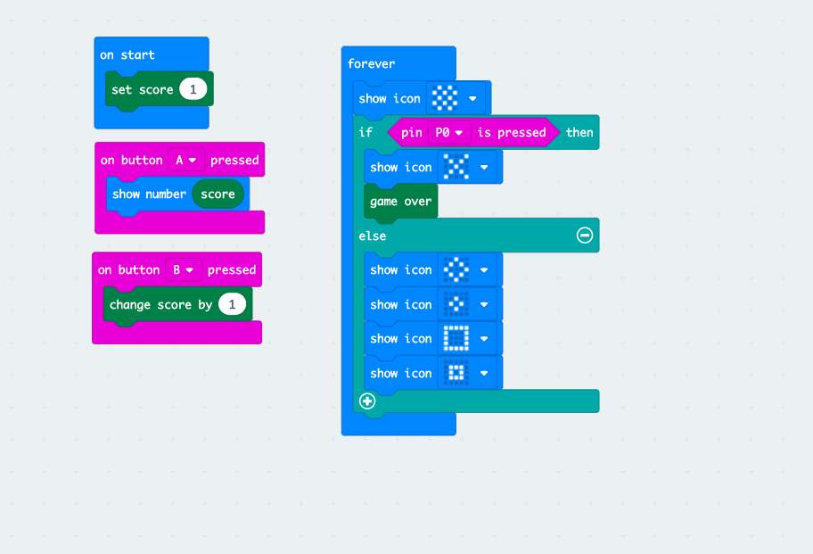

After experimenting with the second design concept, I created my third concept using the knowledge I gained and the avaialble materials that I have at my disposal. Following the interaction flowchart and the overall design itself, I generated the concept and it is represented as follow:

## Design process discussion ##
*Discuss your process in getting to this point, particularly with reference to aspects of the Double Diamond design methodology or other relevant design process.*

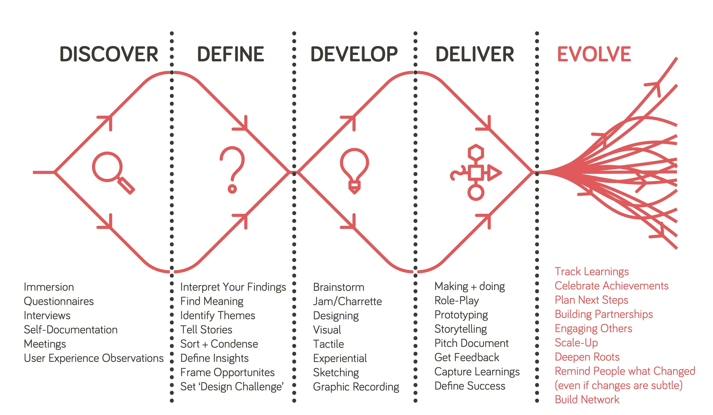

I am going to utilise the Double Diamond design methodology, as they perfectly capture the design process that I went through during this assessment. I wanted to create a project that can either contribute to the local community by maximsing public spaces or to devote my efforts into the Covid-19 pandemic. These two directions helped me to begin with the discover and define stages, where I discovered the topics that I am interested in and defined the different projects that I could explore.

After creating a prototype for a rendition of my second design concept, I realised that I want to contribute some efforts to alleviate the situation of the padenmic and create a game that will keep the same concept as my second design concept. 
Arguably, my third concept came from the developmental phase of the Double Diamond methodolgy, where I creatively design a project based off the hand-eye coordination focal concept. I realised that my second concept design can easily be replicated and has been achieved by numerous Mirco:bit projects, and in order to deliver a successful outcome for this assessment, I would have to design an interesting design that shows an in-depth level of technical development and physical fabrication.

Revolving around the task's underlying requirements and my own criteria, I created a prototype for my final concept, using the same materials and knowledge as my second design concept. The following image lists the different materials that my project will require:

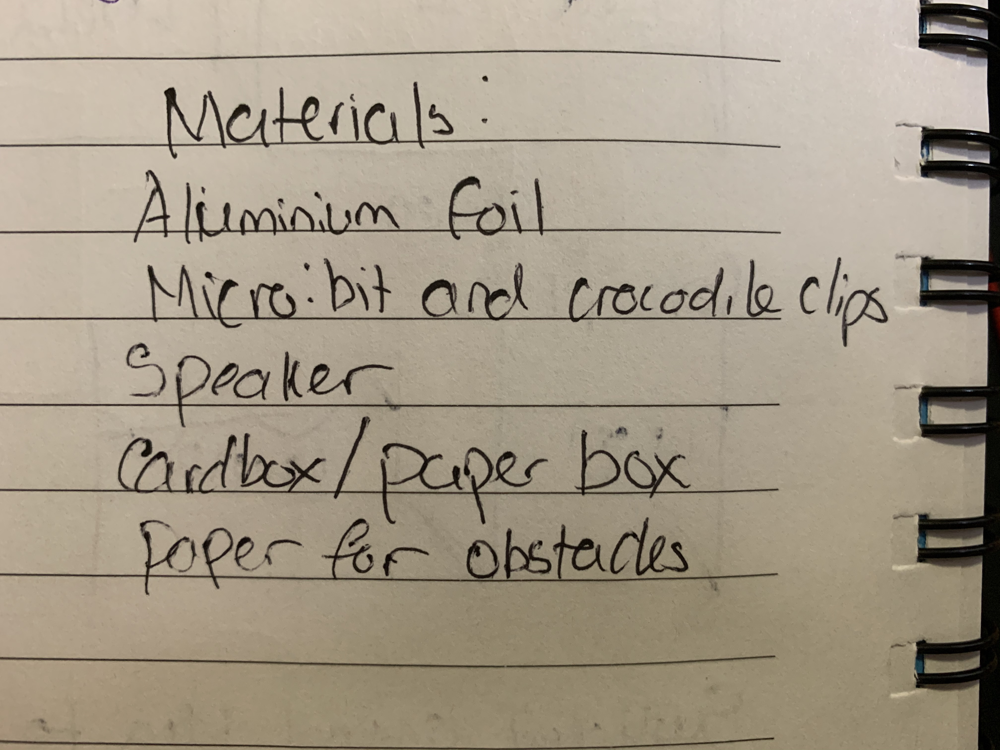

In which, the prototype ultimately became my project for this assessment.  

## Next steps ##
*Write a list or provide other information about your plan to move the project forward to be ready to present by video and documentation in week 12 of the course.*
